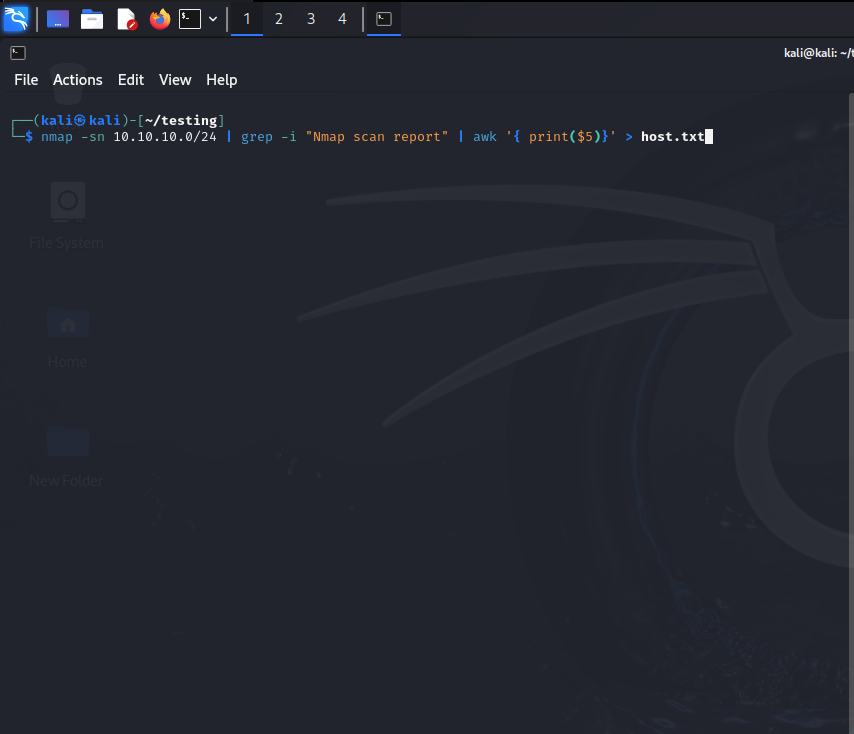
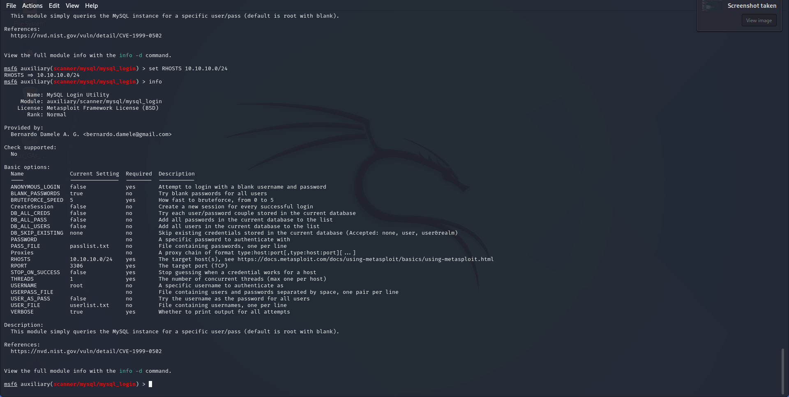
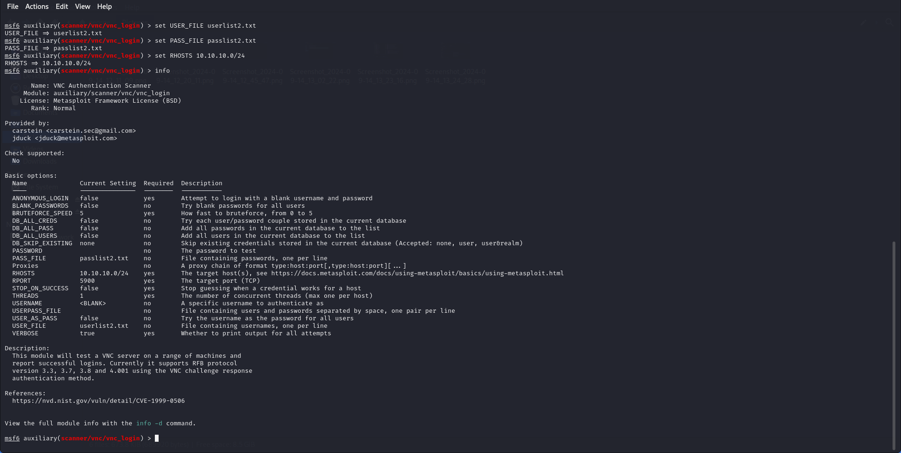

# Internal Network Penetration Testing

## For: Sample Company 

## Submitted By: Cyberlab Internship

## Table of Contents
- [Table of Contents](#table-of-contents)
- [Executive Summary](#executive-summary)
- [Analysis of Overall Security Posture](#analysis-of-overall-security-posture)
- [Key Recommendations](#key-recommendations)
- [Testing Methodology](#testing-methodology)
- [Summary Findings](#summary-findings)
- [Detailed Findings](#detailed-findings)
  - [Path Traversal and File Disclosure Vulnerability](#path-traversal-and-file-disclosure-vulnerability)
  - [Vulnerability in the MySQL Server Product of Oracle MySQL](#vulnerability-in-the-mysql-server-product-of-oracle-mysql)
  - [Wordfence](#wordfence)
  - [Remote Desktop Protocol (RDP) Use-After-Free Vulnerability](#remote-desktop-protocol-rdp-use-after-free-vulnerability)
- [CVSS v3.0 Reference Table](#cvss-v30-reference-table)

  ## Executive Summary
  
Cyberlab Internship performed an internal penetration test of 10.10.10.0/24 provided by Virtual Infosec Africa from September 13th, 2024, through September 15th, 2024. 
This report describes penetration testing that represents the 
network security posture of 10.10.10.0/24, which can be found in the sections below.  

## Analysis of Overall Security Posture 
The overall risk to Virtual Infosec Africa from an internal perspective is High. This determination is made upon the risk inherent in Remote Desktop Protocol (RDP) Use-After-Free Vulnerability. The vulnerability is exploitable remotely over a network through RDP without requiring user interaction. No authentication is required to exploit the vulnerability, making it highly dangerous when RDP is exposed to the internet.

## Key Recommendation 
There are several key recommendations that would significantly enhance the security posture of Virtual Infosec Africa.
- Patch Management: Always keep software and plugins up to date with the latest security patches.
- Access Control: Implement the principle of least privilege to minimize the number of users with access to sensitive systems.
- Monitoring: Regularly monitor logs for unusual activity, especially in services like Apache, MySQL, and RDP.
- Security Best Practices: Use tools like Web Application Firewalls (WAFs), intrusion detection systems (IDS), and input sanitization to reduce attack surfaces.

## Testing Methodology

Testing commenced by utilizing the industry standard vulnerability scanner Nmap
and/or similar scanning tools to locate live hosts and services on the in-scope IP addresses 
provided. The output of this tooling was then manually examined, and the hosts and services were 
manually enumerated to uncover any missed vulnerabilities and weaknesses.

A qualitative risk analysis was conducted using NIST Special Publication (800-30 R1) - Guide for 
Conducting Risk Assessments to map findings to a risk rating. This model is used to define the 
likelihood and impact of a given vulnerability. For additional detail about how the risk ratings were 
determined see Appendix B. 

A subdomain enumeration can be demonstrated using a tool like aiodnsbrute with the domain provided in the scope.

Passing a word list to perform a brute force attack using cewl 

Performing Web-based attack surfaces using eyewitness and msfvenom 

## Summary Findings

 | Finding | Severity |
  |:-------------------:|:-----------:|
  | Remote Desktop Protocol (RDP) Use-After-Free Vulnerability | Critical|
  | Path traversal and file disclosure vulnerability | High |
  | Wordfence | Medium |
  | Vulnerability in the MySQL Server product of Oracle MySQL | Medium |

  
## Detailed Findings 
#####  Path traversal and file disclosure vulnerability
| Current Rating | CVSS |
|:-------------:|:----:|
| High | 7.5 |

##### Finding Summary

##### Evidence

##### Affected Resources
10.10.10.2, 10.10.10.30, 10.10.10.45, 10.10.10.55

##### Recommendations
- Upgrade to Apache HTTP Server 2.4.51 or later to fully patch the vulnerability.
- Ensure that default configuration ("require all denied") is enforced on all directories, especially those that could potentially be exposed via alias directives.
- Disable CGI scripts if they are not necessary, as they can be an entry point for remote code

##### References
https://www.cve.org/CVERecord?id=CVE-2021-41773

#####  Vulnerability in the MySQL Server product of Oracle MySQL
| Current Rating | CVSS |
|:-------------:|:----:|
| Medium | 4.9 |

##### Finding Summary

##### Evidence

##### Affected Resources
10.10.10.5, 10.10.10.40, 
##### Recommendations
- Upgrade: It's critical to upgrade MySQL to a version later than 5.6.49, 5.7.31, or 8.0.21 to address this issue.
- Monitor Privileged Users: Limit access for high-privileged users and monitor their activities to reduce the risk of exploitation.
- Apply Network Security Measures: Restrict network access to the MySQL server to trusted hosts only, reducing the attack surface.

##### References
https://www.cve.org/CVERecord?id=CVE-2020-14812

##### Wordfence
| Current Rating | CVSS |
|:-------------:|:----:|
| Medium | 6.4 |

##### Finding Summary

##### Evidence

##### Affected Resources
10.10.10.10

##### Recommendations
- Update the Plugin: Ensure the plugin is updated to the latest version that patches this vulnerability (if a patch has been released after version 5.3.2).
- Sanitization and Escaping: Developers should ensure that any input, especially user-submitted content like image URLs, is sanitized before being stored and escaped before being output to prevent XSS.
- Limit User Permissions: Restrict access to users with high-privileged roles like contributors or authors. Use the principle of least privilege to minimize the risk of exploitation.
- Security Plugins: Use WordPress security plugins that can help detect and block XSS attacks.

##### References
https://www.cve.org/CVERecord?id=CVE-2024-0837

##### Remote Desktop Protocol (RDP) Use-After-Free Vulnerability
| Current Rating | CVSS |
|:-------------:|:----:|
| Critical | 9.8 |

##### Finding Summary

##### Evidence

##### Affected Resources
10.10.10.11, 10.10.10.31, 10.10.10.60
##### Recommendations
- Apply the MS12-020 security patch provided by Microsoft.
- Disable RDP if not necessary, or restrict RDP access to trusted networks using firewalls.

##### References
https://www.exploit-db.com/exploits/18606

  ## CVSS v3.0 Reference Table 
  | Qualitative Rating | CVSS Score |
  |:-------------------:|:-----------:|
  | None informational | N/A |
  | Low | 0.1-3.9|
  | Medium | 4.0-6.9|
  | High | 7.0-8.9|
  | Critical | 9.0-10.0 |